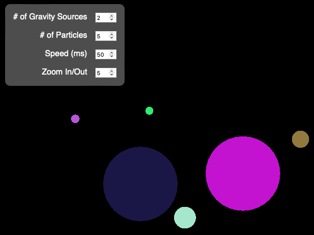

# Three-js-2d-gravity-effect

## About

Uses Three.js to create a 2D gravity simulator with UI to toggle number of centers-of-gravity, number of particles, speed, and zoom in/out.

Each particle has a <b>velocity</b> that is eased by the <b>force</b> that is calculated based on how far away it is from the center of each source of gravity.

## UI:

### !Motion warning!

### Created and hosted on [CodeSandbox, here](https://codesandbox.io/s/github/clarkmu/Three-js-2d-gravity-effect).